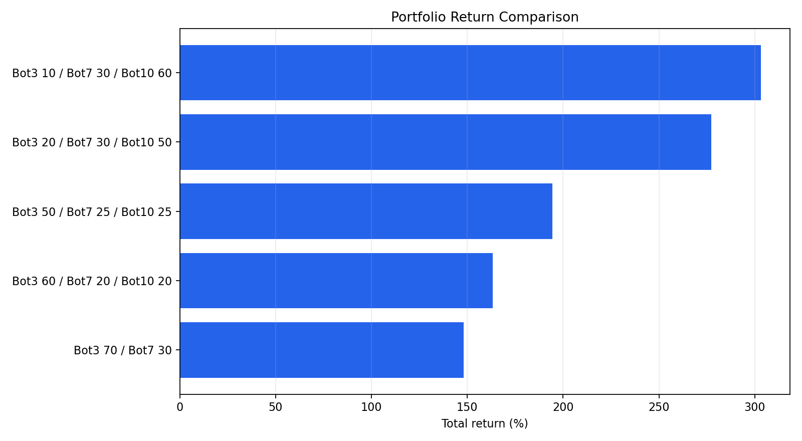
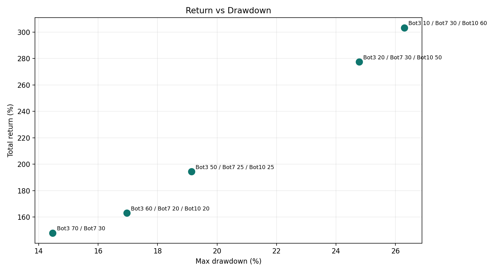
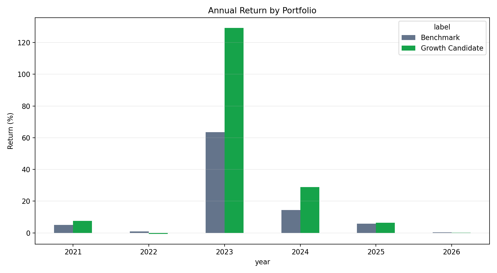
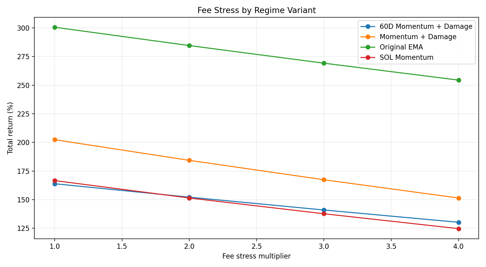

# Systematic Trading Research Engine

A Python research framework for testing systematic crypto trading strategies across multiple assets, market regimes, and portfolio allocations.

This project focuses on the research process behind algorithmic trading systems: data preparation, backtesting, walk-forward validation, fee stress testing, regime detection, portfolio construction, and paper-live monitoring.

It is designed as a research and engineering project, not as financial advice or a promise of future returns.

## Highlights

- Multi-asset strategy backtesting
- Regime filters using trend, momentum, drawdown, volume, and breadth
- Position sizing and portfolio allocation
- Fee and slippage stress testing
- Walk-forward and year-by-year validation
- Paper-live state persistence with SQLite
- Crash-tolerant monitoring loop
- Clean reporting for equity, drawdown, trades, and alerts

## Results Preview

The framework was used to compare strategy engines and portfolio allocations over a multi-year crypto market sample.









## Architecture

The repository uses a package-first structure:

```text
src/trading_research/
  indicators.py      market features and technical indicators
  regimes.py         trend, momentum, drawdown, and volume filters
  strategies.py      strategy signal generation
  backtester.py      cash, positions, trades, and equity curves
  portfolio.py       allocation and correlation utilities
  paper_state.py     SQLite paper-state persistence
  metrics.py         return, CAGR, Sharpe, drawdown, and profit factor
```

More detail is available in [docs/architecture.md](docs/architecture.md).

## Research Pipeline

The research workflow is:

```text
historical candles
  -> feature engineering
  -> regime detection
  -> strategy simulation
  -> fee and slippage stress
  -> walk-forward validation
  -> portfolio allocation
  -> paper-live monitoring
```

The key principle is to test whether an idea survives outside one attractive backtest period.

## Core Ideas

The framework compares several independent strategy families:

| Engine | Idea | Role |
| --- | --- | --- |
| Mean Reversion | Buy severe pullbacks in healthy regimes | Defensive core |
| Relative Strength | Rotate toward stronger assets | Diversification sleeve |
| Trend Pyramid | Add to confirmed winners | Growth sleeve |
| Portfolio Allocator | Combine engines by target weights | Risk management |

## Strategy Evaluation

Each strategy is evaluated using:

- total return and CAGR
- maximum drawdown
- Sharpe ratio
- trade count
- win rate
- profit factor
- best and worst trade
- yearly performance
- fee-stress performance

The framework also checks whether strategies are complementary by comparing their return correlations.

## Walk-Forward Validation

The research process separates attractive in-sample behavior from more useful out-of-sample behavior. Strategies are reviewed across individual years and rolling windows to identify whether performance depends on a single market regime.

## Risk Management

Risk controls include:

- regime filters before entry
- position sizing by sleeve
- trailing stops
- drawdown monitoring
- paper-state recovery
- fee and slippage stress testing
- portfolio-level allocation limits

## Performance Results

Example historical research outputs:

| Portfolio | Return | CAGR | Sharpe | Max Drawdown |
| --- | ---: | ---: | ---: | ---: |
| Benchmark: Bot3 70 / Bot7 30 | 148.05% | 21.48% | 1.46 | 14.47% |
| Growth: Bot3 60 / Bot7 20 / Bot10 20 | 163.16% | 23.03% | 1.38 | 16.96% |
| Growth: Bot3 50 / Bot7 25 / Bot10 25 | 194.40% | 26.03% | 1.38 | 19.14% |
| Growth: Bot3 20 / Bot7 30 / Bot10 50 | 277.37% | 32.91% | 1.30 | 24.78% |

These figures are historical research results and should not be treated as expected future returns.

## Example Research Questions

- Does a strategy survive realistic fees and slippage?
- Does performance hold across different market periods?
- Which assets contribute most to profit and drawdown?
- Are strategy returns correlated or complementary?
- Can regime filters reduce drawdown without removing too much upside?
- Does a simple static allocation beat more complex dynamic allocators?

## Project Structure

```text
Systematic-Trading-Research-Engine/
  README.md
  requirements.txt
  .gitignore
  src/
    trading_research/
      __init__.py
      indicators.py
      metrics.py
      backtester.py
      regimes.py
      strategies.py
      portfolio.py
      paper_state.py
  scripts/
    run_backtest.py
    run_regime_scan.py
    run_paper_cycle.py
  docs/
    architecture.md
    methodology.md
    sample_results.md
```

## Installation

```bash
python -m venv .venv
source .venv/bin/activate
pip install -r requirements.txt
pip install -e .
```

On Windows PowerShell:

```powershell
python -m venv .venv
.venv\Scripts\Activate.ps1
pip install -r requirements.txt
pip install -e .
```

## Expected Data Format

The scripts expect CSV files with these columns:

```text
timestamp,open,high,low,close,volume
```

Timestamps should be parseable by pandas. Files can be daily candles or intraday candles resampled to daily bars.

Example:

```text
data/BTCUSDT.csv
data/SOLUSDT.csv
```

## Run a Backtest

```bash
python scripts/run_backtest.py --data-dir data --symbols BTCUSDT SOLUSDT --start 2021-06-15 --end 2026-06-15
```

## Run a Regime Scan

```bash
python scripts/run_regime_scan.py --data-dir data --symbols BTCUSDT SOLUSDT
```

## Run One Paper Cycle

```bash
python scripts/run_paper_cycle.py --state-file paper_state.db
```

The paper cycle uses SQLite to preserve cash, positions, and events between runs.

## Future Improvements

Planned extensions:

- richer chart generation from saved equity curves
- additional walk-forward reporting
- automated HTML performance reports
- unit tests for execution and portfolio allocation
- optional exchange adapter interface for paper/live separation
- dashboard for paper-live monitoring

## Example Output

Typical reports include:

| Metric | Description |
| --- | --- |
| Return | Total strategy return over the test period |
| CAGR | Annualized return |
| Sharpe | Daily-return Sharpe ratio |
| Max Drawdown | Largest peak-to-trough equity decline |
| Trades | Number of completed trades |
| Profit Factor | Gross profit divided by gross loss |
| Win Rate | Percentage of winning trades |

## Engineering Notes

The code intentionally separates:

- indicators from strategy logic
- strategy logic from portfolio allocation
- backtesting from paper-state persistence
- research scripts from reusable modules

This keeps the framework easier to test, review, and extend.

## Disclaimer

This repository is for research and portfolio-engineering demonstration only. It does not place live orders and should not be used as financial advice.
