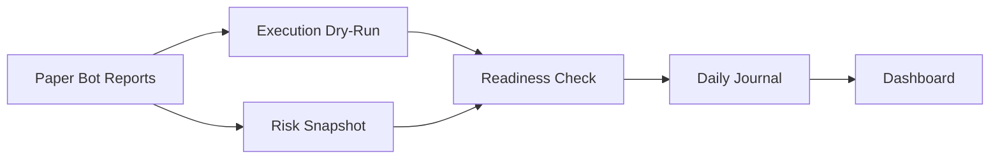

# Architecture

The project is split into reusable modules and small command-line scripts.

## Modules

| Module | Responsibility |
| --- | --- |
| `indicators.py` | Technical indicators and derived market features |
| `regimes.py` | Market-state filters such as trend, momentum, drawdown, and volume |
| `strategies.py` | Strategy signal generation |
| `backtester.py` | Cash, positions, trade execution, and equity tracking |
| `portfolio.py` | Equity-curve blending, correlations, and allocation utilities |
| `paper_state.py` | SQLite persistence for paper-live monitoring |
| `metrics.py` | Return, CAGR, Sharpe, drawdown, win rate, and profit factor |

## Data Flow

```text
CSV candles
  -> indicator preparation
  -> regime detection
  -> strategy signal
  -> backtest execution
  -> equity curve
  -> portfolio analytics
```

## Paper Monitoring

The paper-state layer is intentionally simple:

```text
load state
evaluate signal
update cash and positions
write state
log event
```

This makes each cycle restartable. If a scheduled process stops, the next run can restore the previous state from SQLite.

## Operations Flow



The operations layer is intentionally report-driven. It reads bot outputs, estimates execution cost, aggregates exposure, and checks readiness without placing or signing orders.
