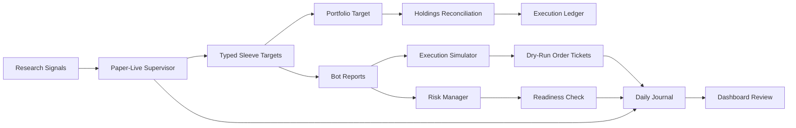

# Operations Layer

The operational layer turns research outputs into monitored paper-live behavior
and explainable broker-neutral order plans. It does not contain a live broker
adapter and it does not place live orders.

## Architecture



## Components

| Component | Purpose | Output |
| --- | --- | --- |
| Supervisor | Runs one-shot paper bot cycles and records health | heartbeat report |
| Execution simulator | Converts generated paper orders into dry-run fill estimates | simulated order tickets |
| Portfolio reconciler | Converts account targets and current holdings into one sell or buy phase | explainable planned tickets |
| Execution ledger | Stores decision cycles and ticket reasons in SQLite | auditable operating history |
| Risk manager | Aggregates bot, symbol, and portfolio exposure | exposure and warning report |
| Readiness check | Confirms paper ops are clean before tiny-live review | readiness status |
| Daily journal | Summarises decisions, alerts, positions, and next actions | daily review note |
| Dashboard | Makes the current state inspectable without reading JSON files | Streamlit operations view |

## Operational Rules

- Paper-live reports are evidence of behavior, not proof of profitability.
- A quiet period is acceptable if the heartbeat is fresh, reports update, and open positions are marked.
- A strategy is not ready for real capital until execution assumptions, state recovery, and risk limits behave correctly.
- Dry-run tickets are review artifacts only. They must never be treated as submitted exchange orders.
- Risk-reducing sells are planned before buys; sale proceeds are not assumed available until broker state is refreshed.
- Execution controls are account-relative and market-rule aware, not fixed cash-account tiers.
- Manual exchange checks are required before any live adapter is connected.

## Healthy Waiting vs Silent Failure

Healthy waiting looks like this:

- supervisor heartbeat is fresh
- latest cycle completed without alerts
- execution simulator checked reports
- risk manager has no warnings
- signal proximity radar shows closest blocked setup and stale-report count
- daily journal says to keep monitoring
- equity and open positions continue to update

Silent failure looks like this:

- stale heartbeat
- missing or old reports
- repeated timeouts
- frozen equity across live market movement
- unexplained state reset
- guardrail reports missing from the latest cycle

## Dashboard Usage

From the repository root:

```powershell
pip install -r requirements.txt
streamlit run dashboard\ops_dashboard.py
```

By default, the dashboard looks for a sibling `top5_ops` folder. To point it at a different report folder:

```powershell
$env:PAPER_OPS_ROOT="C:\path\to\top5_ops"
streamlit run dashboard\ops_dashboard.py
```

## Public Repository Boundary

This repository intentionally keeps the operations code sanitized. Local sprint outputs, raw market data, credentials, exchange keys, and private paper-state databases should stay outside the public repo.

The public version should demonstrate:

- the architecture of the system
- the validation process
- the monitoring logic
- the risk checks
- reproducible examples

It should not expose private trading accounts, API details, or unreviewed experimental scripts.

